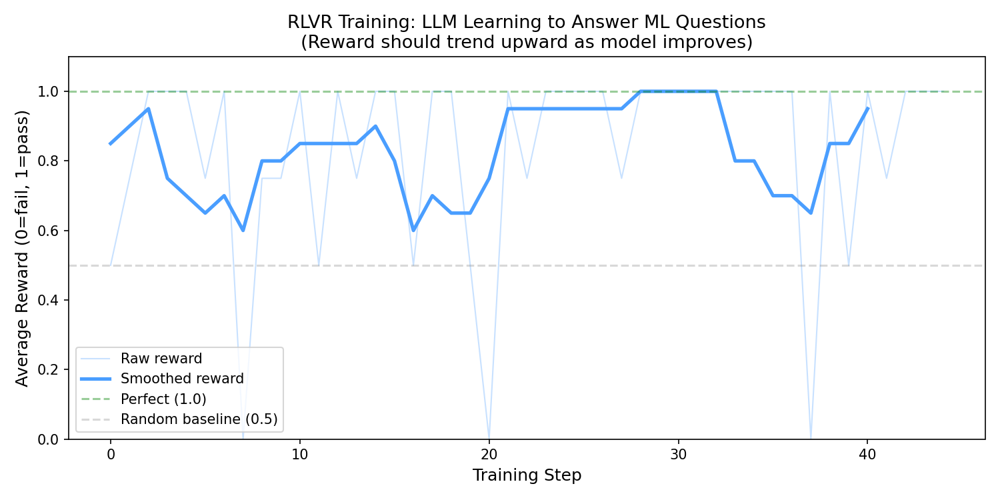

# RLVR Training Demo

I built this to get hands-on with RLVR before writing a take-home for Preference Model. The task was to design an RL environment for LLM training -- I wanted to actually run a pipeline before proposing one.

## What this is

A toy GRPO training loop using `Qwen/Qwen2.5-0.5B-Instruct`. The model answers short ML trivia questions and gets scored by a string-matching judge. If the correct answer appears in the output, score = 1. If not, score = 0.

Not complicated on purpose. The point was to understand how the pieces fit: prompt → generate → judge → reward → policy update.

## What I found

The reward curve trends up and hits perfect-score batches by the end of training. The model learns to produce answers that pass the verifier.



The judge is the weak point though. It uses substring matching, so "The answer is sigmoid" scores 1.0 -- which is fine -- but a response that mentions "0" anywhere also scores 1.0 for a question where the answer is 0. For a toy demo this is okay. For a real environment you'd want execution-based evaluation, not string matching. That's the gap I wrote about in my take-home.

## Files

- `llm_env_demo/train.py` -- GRPO training loop
- `llm_env_demo/judge.py` -- reward function (string matching)
- `llm_env_demo/problems.py` -- 15 ML questions with verifiable answers
- `llm_env_demo/evaluate.py` -- compare base vs trained model
- `llm_env_demo/plot.py` -- reward curve plot

## How to run

```bash
cd llm_env_demo
pip install -r requirements.txt
python train.py
python plot.py
python evaluate.py
```